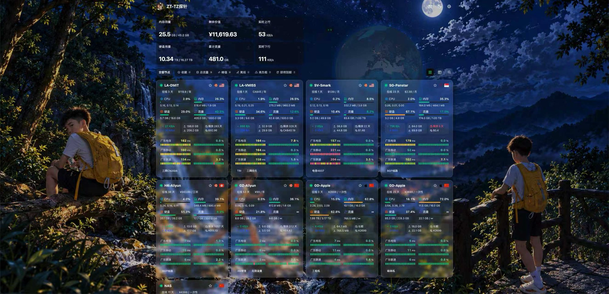

<!--
  Personal secondary creation.
  Built on the open-source "Komari Glassmorphism" theme by sanrokamlan (MIT),
  originally at https://github.com/sanrokamlan-prog/komari-theme-Glassmorphism
  Feedback & redesigned by maxxx0229. Thanks to the original author for open-sourcing.
-->

> 🙏 **Acknowledgement / 致谢**
> 本项目是基于开源主题 **Komari Glassmorphism**（作者 **sanrokamlan**，MIT 协议）的**个人二次创作**：
> 我重新设计了节点卡片的毛玻璃视觉系统、修复了内核渲染兼容问题，并扩展了货币与汇率能力。
> All credit for the original design and architecture goes to the upstream author(s) — thanks for open-sourcing.

<div align="center">

# 🌌 Glasstheme-xxdd

### 为 Komari 打造的「玻璃拟态 · 运维驾驶舱」

**真实的毛玻璃质感 · 可视化卡片特效 · 财务与汇率 · 三网质量**


**[📥 下载 Release](https://github.com/maxxx0229-collab/Glasstheme-xxdd-Komari/releases)** ·
**[🚀 快速安装](#-快速安装)** ·
**[✨ 定制亮点](#-定制亮点)** ·
**[⚙️ 主题设置](#️-主题设置)**

</div>

---

## 📸 预览

<div align="center">



</div>

---

## ✨ 定制亮点

> 上游主题提供了扎实的骨架；这一版由我重新设计视觉系统并深入内核兼容层，
> 让「毛玻璃」不再只是半透明色块，而是**真正的高斯模糊、真正可调**。

### 🧊 节点卡片毛玻璃特效

全部在 Komari 后台可视化调节，保存即生效：

| 控件 | 作用 |
| :--- | :--- |
| **毛玻璃开关** | 一键切换「半透明磨砂」与「不透明纯色」两种卡片形态 |
| **模糊程度** | 0–60px 高斯模糊强度，越大越朦胧 |
| **卡片通透度** | 控制底框透明程度，背景透出越多、磨砂感越强 |
| **卡片着色 (Hex)** | 直接填 `#9b1c1b` 为卡片着色；`#ffffff` 表示保持主题原色 |
| **卡片明亮度** | 0 = 浅色主题卡片色 ↔ 100 = 深色主题卡片色，平滑过渡 |
| **偏色 · 色相 / 色温** | 整体色调微调（暖橙 ↔ 冷蓝） |

同时修复了 Chromium 上 `backdrop-filter` 被静默禁用的兼容问题——告别"看着像毛玻璃、其实没有模糊"，现在是货真价实的高斯虚化。

### 💱 货币与汇率

- 节点货币在后台**填写英文代码**（`USD` / `CNY` / `CAD` / `EUR` / `GBP` / `JPY` …），面板**自动显示对应符号**（`$` / `¥` / `CA$` / `€` / `£` …）；
- 新增 **CAD 加拿大元** 全链路支持（卡片、财务、汇总、汇率换算）；
- 汇率数据源接入 **[exchangerate-api.com](https://www.exchangerate-api.com/)**，实时汇率、每日缓存、多源自动回退；
- 历史以符号（`$`、`¥`）保存的数据自动识别归一，无需手动迁移。

### 🧭 其余继承自上游的优秀能力

| 类别 | 能力 |
| :--- | :--- |
| 首页驾驶舱 | 真实地球 / 点阵地球 / 平铺地图三种视觉；卡片 / 列表双视图；四档卡片密度；10 套总览方案 + 自定义排序 |
| 节点详情 | 12 个图表族、18 类概览指标、多套预设；GPU、温度、Ping 延迟与丢包图表 |
| 三网质量 | 电信 / 联通 / 移动分线路展示延迟与丢包，双色条 + 20 格采样 |
| 财务分析 | 剩余价值、按量费用估算、汇率覆盖、月均支出 |
| 运维工具 | 拓扑分析、性价比排行、健康摘要、快照导出、访客审计（登录后可见） |
| 视觉与无障碍 | 色觉友好配色、亮 / 暗 / 北京时间自动模式、自定义图片或视频背景 |

---

## 🚀 快速安装

### 方式一：Komari 后台直接填写仓库地址

```text
https://github.com/maxxx0229-collab/Glasstheme-xxdd-Komari
```

### 方式二：手动安装 Release

1. 打开 [Releases](https://github.com/maxxx0229-collab/Glasstheme-xxdd-Komari/releases)
2. 下载最新的 `Glasstheme-xxdd-v*.zip`
3. 登录 Komari Monitor 后台 → **设置 → 主题管理** → 上传 zip → 启用
4. 进入「主题设置」按需调整

> 请上传 Release 附件中的主题 zip，不要使用 GitHub 自动生成的源码压缩包。

---

## ⚙️ 主题设置

全部设置由 [`komari-theme.json`](komari-theme.json) 托管，在 Komari 后台可视化调整，无需修改代码。

| 分类 | 内容 |
| :--- | :--- |
| 01 · 基础与外观 | 主题模式、数据刷新间隔、RPC 模式、默认视图与卡片尺寸 |
| 02 · 首页布局 | 公告、地球样式、访客信息、毛玻璃配色、色觉辅助 |
| 03 · 首页总览卡片 | 10 套方案 + 自定义 keys 与顺序 |
| 04 · 高级工具与隐私 | 工具开关、隐藏后台 / 价格、厂商别名、导出二级密码 |
| 05 · 节点卡片、列表与快捷控制 | 快捷按钮、列表字段、离线置底、预警阈值 |
| 06 · 节点详情概览卡片 | 18 类指标卡、7 套方案 |
| 07 · 节点详情图表 | 12 个图表族、9 套方案、GPU 图表 |
| 08 · 自定义背景 | 亮 / 暗模式图片或视频、模糊与遮罩 |
| **09 · 节点卡片毛玻璃特效** | **模糊程度 / 通透度 / Hex 着色 / 明亮度 / 色相 / 色温（本版新增）** |

---

## 🛠️ 本地开发

环境要求：Node.js `^20.19.0` 或 `>=22.12.0`，Bun `>=1.2.0`

```bash
bun install     # 安装依赖
bun run dev     # 启动本地开发
bun run build   # 构建主题（产出 dist/ 与可安装 zip）
```

构建成功后会生成 `dist/` 和 `komari-theme-*.zip`，后者即主题安装包。

---

## 🌍 兼容性

- **Komari** 1.2.x 及以上；新版 Metric API 优先，旧接口自动回退；
- **浏览器**：现代 Chrome / Edge / Firefox / Safari 15.4+ / 移动端响应式；
- **毛玻璃**：Chromium 新版下真实高斯模糊（已修复渲染兼容）；Firefox 自动降级为不透明表面以保证流畅。

---

## 🙏 致谢

感谢 [Komari](https://github.com/komari-monitor/komari)、[Komari Naive](https://github.com/tonyliuzj/komari-naive)、Vue、Vite、reka-ui、Tailwind CSS 等优秀开源项目，以及所有反馈与建议的朋友。

## 📄 License

[MIT](LICENSE) —— 本主题为基于上游 MIT 协议的二次创作，原始版权归原作者所有。
